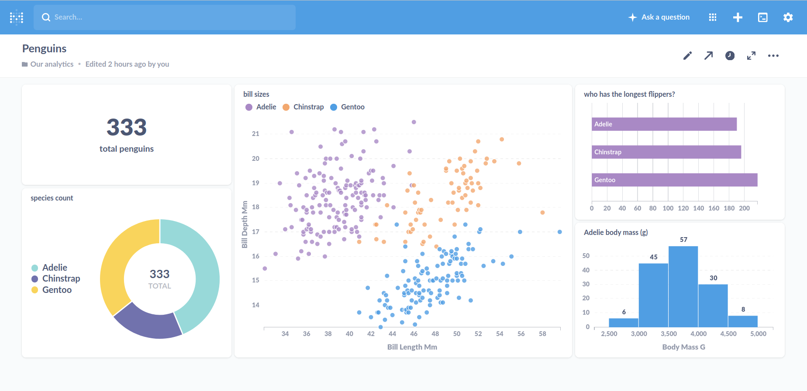

Exercise: Creating Tables
=========================

**Create a table in SQL and fill it with data.**

### 1. Connect to Postgres

Connect to your Postgres database via the command line:

    psql

If you specified a username (-U) or database name (-d) earlier, do it again.

------------------------------------------------------------------------

### 2. Create a table

Adapt the SQL command for creating a table that matches your CSV data.
Here you find a starting point:

    CREATE TABLE IF NOT EXISTS penguins (

        id SERIAL PRIMARY KEY,    
        species TEXT,
        gender VARCHAR(10),
        bill_length_mm NUMERIC NOT NULL,
        body_mass_g INT CHECK (body_mass >= 0 AND body_mass < 10000)

    );

You should see the response:

    CREATE TABLE

------------------------------------------------------------------------

### 3. Load data

Copy **one** CSV file to the newly created table.

Adapt the command:

    \copy penguins FROM '<path>/penguins.csv' DELIMITER ',' CSV HEADER;

Replace `<path>` by the **absolute path** to your `penguins.csv` using
**forward slashes** (`/`).

You should see a response like:

    COPY 50

This tells you that 50 rows have been copied into the table.

------------------------------------------------------------------------

### 4. Inspect the data

Make sure that the data is in your table by typing in the query:

    SELECT * FROM penguins;

----

## License

(c) 2022 Dr. Kristian Rother

Shared under the conditions of the Creative Commons Attribution Share-Alike License 4.0
